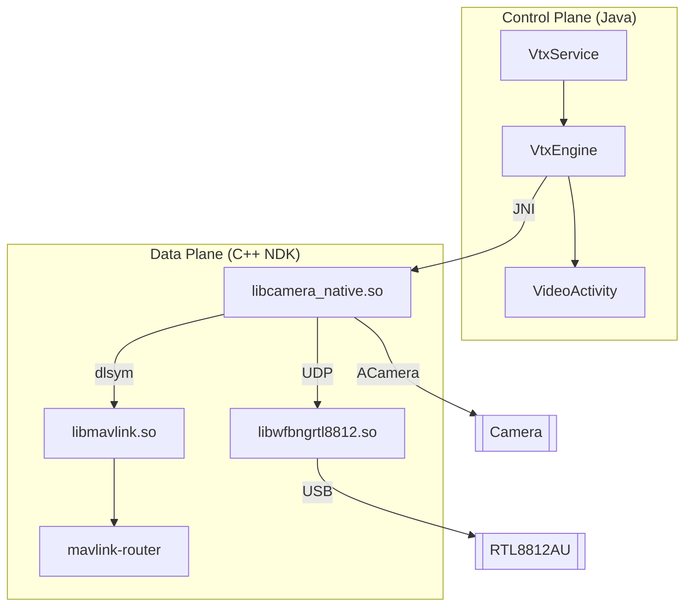

# Android VTX

This application is a digital video transmitter for Android devices. It allows a smartphone to capture and stream video at high frame rates (up to 240 FPS) using a native C++ data plane.

## Key Features

*   **Native Data Plane:** Video capture and encoding are handled in C++ using `ACamera` and `AMediaCodec` APIs to minimize latency and avoid Java Garbage Collection overhead.
*   **High Frame Rate Support:** Configurable support for 120 FPS and 240 FPS capture modes on compatible hardware.
*   **Video Encoders:** Supports H.264 (AVC) and H.265 (HEVC) hardware encoding.
*   **Headless Operation:** Core components run in a persistent Android Service (`VtxService`), allowing the transmission to continue independently of the UI state.
*   **Telemetry Integration:** Integrated `mavlink-router` for bidirectional MAVLink communication and a native scheduler for localized telemetry (e.g., encoder latency).
*   **Radio Integration:** Built-in support for `wfb-ng` air link utilizing RTL8812AU adapters.

## System Architecture

The project is structured with a Java control plane for configuration and a C++ NDK data plane for performance-critical operations.



## Getting Started

### Hardware Requirements
*   Rooted Android device with high-speed camera support.
*   RTL8812AU USB WiFi Adapter.
*   OTG cable for adapter connection.

### Installation & Setup
1.  Launch the application and grant required Root and Camera permissions.
2.  Enable **VTX Mode** in the application settings.
3.  Connect the WiFi adapter via OTG and grant USB permissions.
4.  Transmission will begin automatically based on the configured settings.

### Ground Station Configuration (H.264)
The stream can be viewed on a Linux ground station using GStreamer:
```bash
gst-launch-1.0 -v udpsrc port=5600 ! h264parse ! avdec_h264 ! autovideosink sync=false
```

## Build Instructions

### Prerequisites
*   Android Studio Hedgehog (2023.1.1) or newer.
*   Android NDK and CMake.

### Build Steps
```bash
git clone https://github.com/NinadRagit/android-vtx.git
cd android-vtx
git submodule update --init --recursive
```
Open the project in Android Studio and perform a standard Gradle build.

## Documentation
*   [Architecture Overview](docs/architecture_overview.md): Technical details on the headless NDK architecture.
*   [WFB HT MCS Fix](docs/wfb-tx-fix.md): Analysis of the RTL8812AU performance optimizations.
